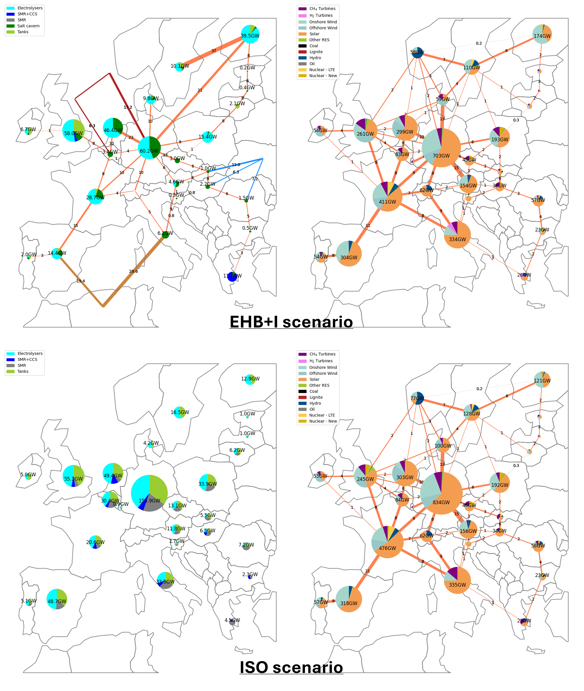

# POMMES-BEH2I 
This repository presents running code and input data for a European electricity and hydrogen model. It uses a specific version of [POMMES](https://github.com/qraillard/pommes-milp), an open source framework to model investment pathways in multi-energy systems.

The framework enables to minimise the system costs to meet the energy services demand by modelling the investment
and operating costs of energy conversion, storage and transport technologies.

POMMES-BEH2I was built upon the [POMMES-EU repository](https://github.com/qraillard/POMMES-EU) and developed to study electricity and hydrogen capacity expansion in production and storage technologies under different hydrogen infrastructure settings. Thus, the dataset includes 3 scenarios :
+ ISO - Isolated Hydrogen Systems
+ EHB - European Hydrogen Backbone
+ EHB+I - European Hydrogen Backbone allowing for extra-european imports

With a focus on Belgium, the dataset provides as well another case redispatching hydrogen demand in Belgium among different hydrogen consuming industry clusters to assess the impact of an increase in spatial granularity.

